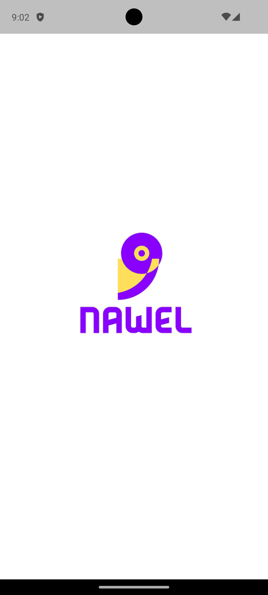
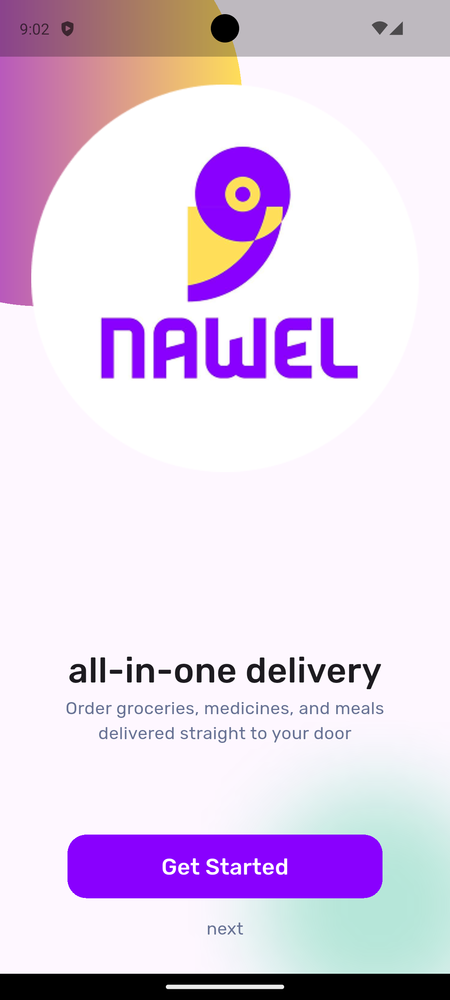
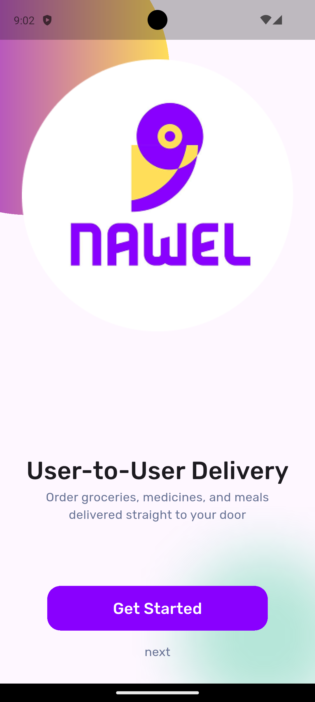
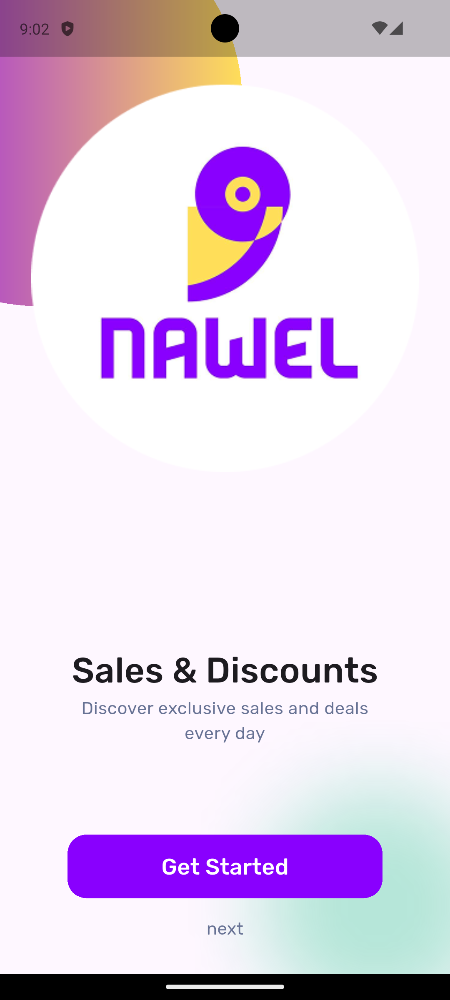
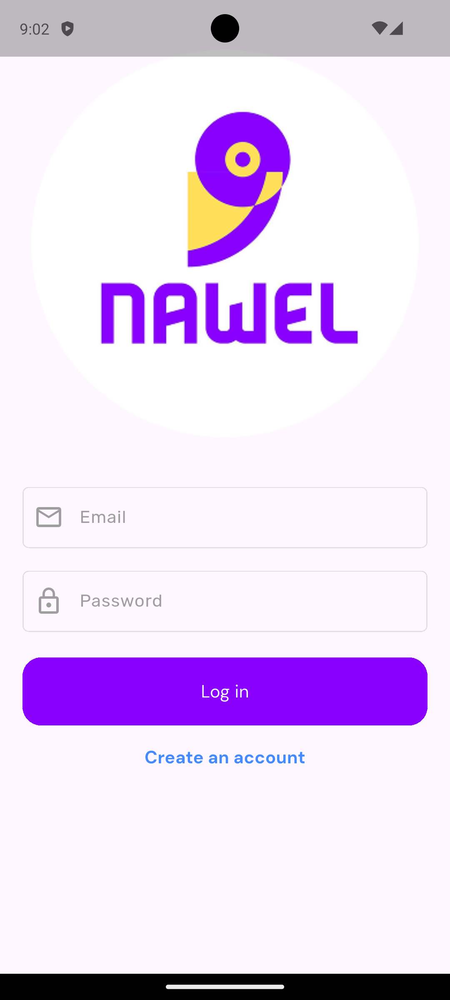
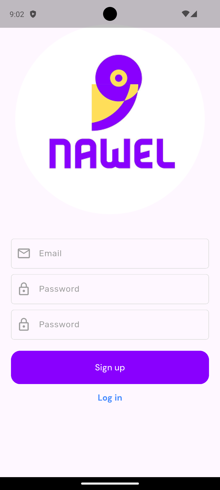
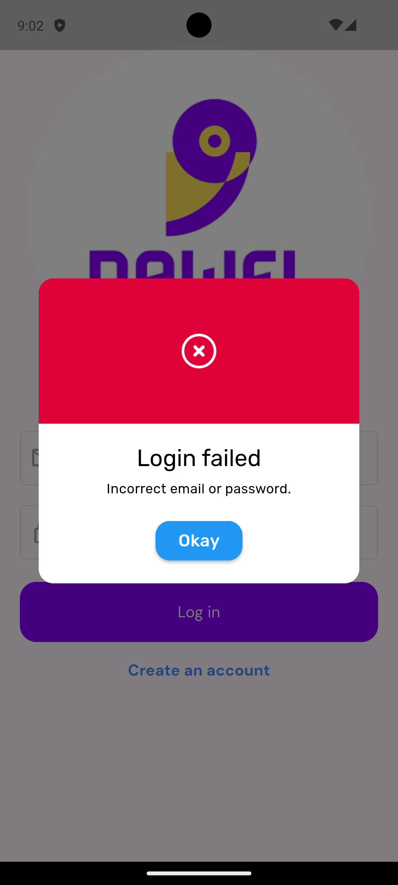
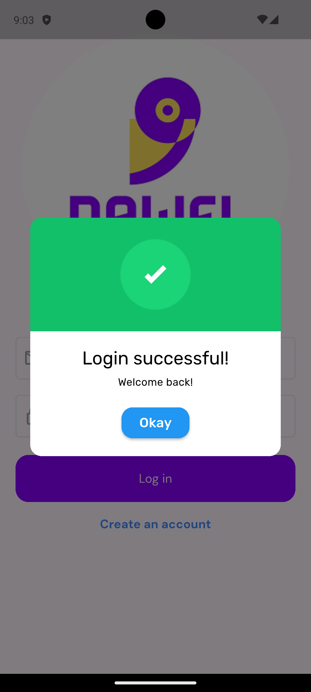
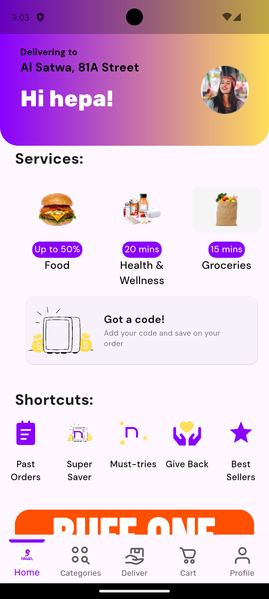

# AUVNET Internship Assessment

It's a simple e-commerce application all implemented in clean architecture and applying SOLID principles

## ➕ Features

- User authentication/registration using Firebase Authentication
- Getting offers and nearby shops from Firestore
- Responsive Design for mobile and desktop devices
- Error Handling and Logging
- Performance Optimization

## ⏬ Installation

```bash
git clone https://github.com/AhmedSamy02/AUVNET-Internship-Assessment
flutter pub get
flutter run
```

## 📷 Screenshots

| Splash Screen | Onboarding Screen | Onboarding Screen |
|:-------------:|:--------------:|:------------:|
|  |  |  |

| Onboarding Screen | Login Screen | Register Screen |
|:---------------:|:-----------:|:----------------------:|
|  |  |  |

| Login Failed Screen | Login Success Screen | Home Screen |
|:-----------------:|:-----------:|:---------------:|
|  |  |  |

## 🧑‍💻 Technologies

- Bloc State management
- Firebase Authentication
- Firebase Firestore
- Firebase Storage
- Hive for local storage

## 📝 Appendix

UI -> <https://www.figma.com/community/file/1516187112598079359>
